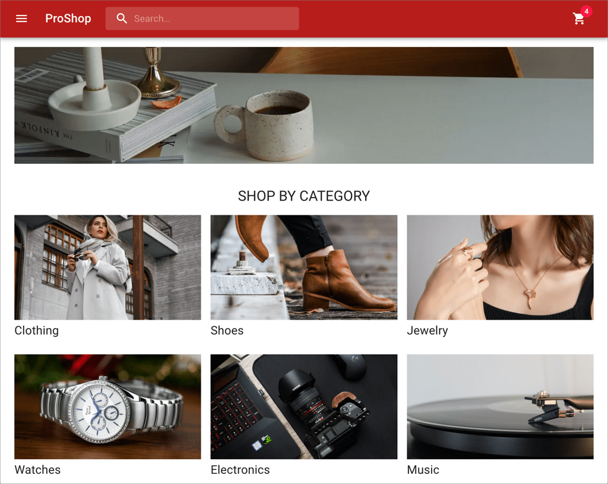

# ProShop Nx

A sample eCommerce app to show best practices in web development using Nx.



## Tech Stack

- [Nx](https://nx.dev/)
- [TypeScript](https://www.typescriptlang.org/)
- [React](https://reactjs.org/)
- [Next.js](https://nextjs.org/)
- [GraphQL](https://graphql.org/)
- [Apollo GraphQL](https://www.apollographql.com/)
- [Material UI](https://mui.com/)

## Architecture

The ProShop app consists of two micro-frontends which are separate web apps
deployed at two different ports:

1. Catalog App: Displays the product catalog and allows the user to add products
   to the cart.
2. Cart App: Displays the cart and allows the user to manage it, i.e. add,
   delete and update items). Once the user is happy with the cart, they can
   place an order. (Note that this is a very simplified checkout process - there
   is no provision for collecting shipping and/or payment information.)

- Both micro-frontends talk to a GraphQL API called the `proshop-api`.
- Both micro-frontends share a common UI library called `ui-lib`.

## Development Build

Clone a fresh copy of the repo:

```sh
git clone https://github.com/nareshbhatia/proshop-nx.git
cd proshop-nx
```

Create environment variables for local development. To do this,
create a file at the root of your repo called `.env.local` and
add the following variables to it.

```
NX_API_PORT=3333
NX_API_URL=http://localhost:3333
```

> Note: This file should not be checked into git. It is already
> added to .gitignore.

Now follow the steps below:

```sh
# For a better developer experience, install the Nx CLI globally
npm install -g nx

# Install workspace dependencies
npm install

# Run the web apps and the GraphQL back-end
nx run-many --target=serve --all
```

Open two tabs in your browser and point them to the following URLs:

1. http://localhost:4200/: Catalog app home page.
2. http://localhost:4201/: Cart app home page.

## Production Build

First, build your app for production:

```sh
nx run-many --target=build --all --configuration=production
```

Then run the app in production mode:

```sh
nx run-many --target=serve --all --configuration=production
```

## Building Docker images

Docker build should be done in a freshly cloned repo to avoid copying of `dist`,
`node_modules` etc.

```sh
# Clone a fresh copy of the repo
git clone https://github.com/nareshbhatia/proshop-nx.git proshop-nx-docker
cd proshop-nx-docker

# Optional: Cache the node docker image for faster builds
docker pull node:16.14.0-alpine

# Build docker images
docker build -f Dockerfile.api -t nareshbhatia/proshop-api:1.0.0 .
docker build -f Dockerfile.catalog -t nareshbhatia/catalog:1.0.0 .
docker build -f Dockerfile.cart -t nareshbhatia/cart:1.0.0 .

# Verify that the images were created on the local machine
docker images -a

# Find your machine's IP address on the local network
# (not the external Internet address). For the commands
# below, we will use 192.168.86.247, please replace it
# with yours.
ipconfig getifaddr en1 # for Mac
ipconfig /all          # for Windows

# Note that this is a hack for catalog and cart containers to
# hit the GraphQL API. Connecting to http:localhost:8080 from
# within the container gives an ECONNREFUSED error! Docker's
# networking does not understand that we are referring to the
# machine's localhost and not the container's localhost. Anyway,
# this hack is ok for now, because we are simply trying to make
# sure that the Docker images are good.

# Run the images locally to make sure everything works. Replace
# 192.168.86.247 with you local IP address. Launch the catalog
# and cart apps in your browser (ports 4200 & 4201) and make
# sure they work.
docker run -d --rm --name proshop-api -p 8080:8080 nareshbhatia/proshop-api:1.0.0
docker run -d --rm --name catalog -p 4200:4200 -e NX_API_URL=http://192.168.86.247:8080 nareshbhatia/catalog:1.0.0
docker run -d --rm --name cart -p 4201:4201 -e NX_API_URL=http://192.168.86.247:8080 nareshbhatia/cart:1.0.0

# Push the images to Docker Hub
docker login -u nareshbhatia --password-stdin
docker push nareshbhatia/proshop-api
docker push nareshbhatia/catalog
docker push nareshbhatia/cart
```

## Help

Visit the [Nx Documentation](https://nx.dev) to learn more.
