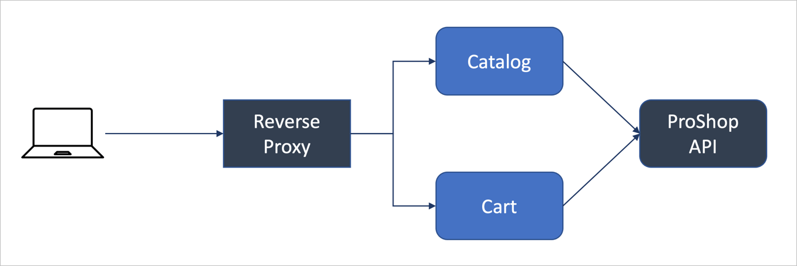

# ProShop Nx

A sample eCommerce app to show best practices in web development using Nx.


## Tech Stack

- [Nx](https://nx.dev/)
- [TypeScript](https://www.typescriptlang.org/)
- [React](https://reactjs.org/)
- [Next.js](https://nextjs.org/)
- [GraphQL](https://graphql.org/)
- [Apollo GraphQL](https://www.apollographql.com/)
- [Material UI](https://mui.com/)

## Architecture



The ProShop app consists of two micro-apps (Catalog and Cart) sitting behind a
_Reverse Proxy_. The reverse proxy accepts requests from external clients and
depending on the request path, directs them to one of the two micro-apps. Thus,
the two micro-apps give the appearance of a single cohesive web app.

The **Catalog App** displays the product catalog and allows the user to add
products to the cart.

The **Cart App** displays the cart and allows the user to manage it, i.e. add,
delete and update items. Once the user is happy with the cart, they can place an
order. (Note that this is a very simplified checkout process - there is no
provision for collecting shipping and/or payment information.)

- Both micro-apps talk to a GraphQL API called the Proshop API.
- Both micro-apps share a common UI library called `ui-lib`.

## Development Build

Clone a fresh copy of the repo:

```sh
git clone https://github.com/nareshbhatia/proshop-nx.git
cd proshop-nx
```

Create environment variables for local development. To do this, create a file at
the root of your repo called `.env.local` and add the following variables to it.

```
NX_API_PORT=8080
NX_API_URL=http://localhost:8080
```

> Note: This file should not be checked into git. It is already added to
> .gitignore.

Now follow the steps below:

```sh
# For a better developer experience, install the Nx CLI globally
npm install -g nx

# Install workspace dependencies
npm install

# Run the web apps and the GraphQL back-end
nx run-many --target=serve --all
```

Open two tabs in your browser and point them to the following URLs:

1. http://localhost:3001/catalog: Catalog app home page
2. http://localhost:3002/cart: Cart app home page

## Production Build

First, build your app for production:

```sh
nx run-many --target=build --all --configuration=production
```

Then run the app in production mode:

```sh
nx run-many --target=serve --all --configuration=production
```

Open two tabs in your browser and point them to the following URLs:

1. http://localhost:3001/catalog: Catalog app home page
2. http://localhost:3002/cart: Cart app home page

## Running ProShop using Docker Compose

> Note: If you have not installed Docker Desktop, install it now. See
> instructions [here](https://www.docker.com/get-started).

```sh
# Build docker images
docker build -f infrastructure/Dockerfile.api -t nareshbhatia/proshop-nx-api:1.0.0 .
docker build -f infrastructure/Dockerfile.catalog -t nareshbhatia/proshop-nx-catalog:1.0.0 .
docker build -f infrastructure/Dockerfile.cart -t nareshbhatia/proshop-nx-cart:1.0.0 .

# Verify that the images were created on the local machine
docker images -a

# Run images using Docker Compose
docker-compose -f infrastructure/docker-compose.yaml up --detach
```

Point your browser to the reverse proxy at http://localhost/catalog. You should
be able to navigate from catalog to cart and back.

After testing, you can shut down Docker Compose using the command below:

```sh
docker-compose -f infrastructure/docker-compose.yaml down
```

If all this works push your images to Docker Hub

```sh
docker login -u nareshbhatia --password-stdin
docker push nareshbhatia/proshop-nx-api:1.0.0
docker push nareshbhatia/proshop-nx-catalog:1.0.0
docker push nareshbhatia/proshop-nx-cart:1.0.0
```

## Running ProShop in a Kubernetes cluster

> Note: This does not work currently.

> Note: If you have not installed minikube, install it now. See instructions
> [here](https://minikube.sigs.k8s.io/docs/start/). Also you should have
> installed Docker Desktop (see instructions above).

- Start minikube

```sh
minikube start --driver docker
```

- Now apply YAML files to the minikube instance to deploy Proshop components:

```sh
kubectl apply -f infrastructure/k8s-api-config.yaml # ConfigMap
kubectl apply -f infrastructure/k8s-api.yaml        # API deployment & service
kubectl apply -f infrastructure/k8s-catalog.yaml    # Catalog app deployment & service
kubectl apply -f infrastructure/k8s-cart.yaml       # Cart app deployment & service
```

You can now run apps inside minikube:

```sh
minikube service catalog-service # terminal 1
minikube service cart-service    # terminal 2
```

Note that the terminals need to remain open for the webapp to run. Control-C
will stop the respective app.

## Help

Visit the [Nx Documentation](https://nx.dev) to learn more.
